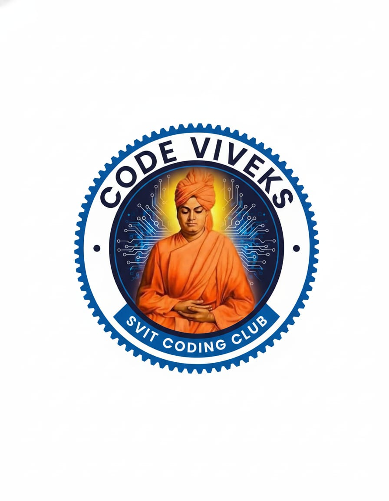

<div style="display: flex; justify-content: space-between; align-items: center; margin-bottom: 30px;">
  <a href="https://codeviviekdemo.netlify.app/" target="_blank" rel="noopener noreferrer" style="margin-right: 20px;">
    <picture>
      <source media="(prefers-color-scheme: dark)" srcset="Assets/code-viveks-logo.jpg">
      
    </picture>
  </a>
</div>

# 🚀 RVCE Coding Bootkit

_A curated bootkit for first-year students, interested in Computer Science, to explore core concepts, tools, and resources._

<br>

## 📚 What is This Repository?

This repository is a centralized knowledge base designed to help first-year students get started with programming, development, computer fundamentals, and more. Whether you're preparing for coding rounds, exploring internships, or understanding how the internet works, this toolkit has you covered.

🧠 **No prior experience needed — just curiosity and consistency!**

These are the resources being maintained by:

1. [M. Sai Deekshith](https://github.com/SaiDeekshith2504) - [LinkedIn](https://www.linkedin.com/in/munaga-sai-deekshith-62a173203)
2. [Younus Syed](https://github.com/YounusSyed186) - [LinkedIn](https://www.linkedin.com/in/younus-syed-2b7913295/)
3. [Advait Joshi](https://github.com/TheUsefulNerd) - [LinkedIn](www.linkedin.com/in/advaitszone)

## 📂 Structure - Resources Folder

| Folder                  | What's Inside                                           |
| ----------------------- | ------------------------------------------------------- |
| AI-ML                   | Basics of Artificial Intelligence & Machine Learning    |
| Blockchain              | Introduction to blockchain concepts and smart contracts |
| C                       | Foundational programming in C language                  |
| CPP                     | C++ programming concepts including OOP                  |
| CS-Fundamentals         | OS, DBMS, memory, logic gates & other essentials        |
| Cloud-DevOps            | Intro to cloud services, GitHub Actions, CI/CD          |
| Competitive-Programming | CP questions, tricks, and templates                     |                    |
| DSA                     | Data Structures & Algorithms explained with code        |
| Flutter                 | Getting started with Flutter for app development        |
| Git-GitHub              | Version control, Git commands, collaboration tips       |
| HTML-CSS                | Basics of web structure and styling                     |
| Hackathons              | Ideas, preparation, and resources to participate        |
| Hardware                | Electronics, chips, sensors, IoT basics                 |
| Internships             | Resume tips, portfolio building, how to apply           |
| Java                    | Java syntax, OOP, exception handling, and more          |
| JavaScript              | DOM manipulation, ES6+, browser scripting               |
| Project-Ideas           | Mini-projects and ideas to build your portfolio         |
| Python                  | Python basics, OOP, file handling, scripts              |

---

## 🧭 How to Use This Repository

Follow these simple steps to start learning:

### 1. Clone the Repository

```bash
git clone https://github.com/](https://github.com/CodeVivekSVIT2025-dev/Code-Viveks-Bootkit.git)
```

```bash
cd Code-Viveks-Bootkit
```

### 2. Browse by Topic

-   Choose a topic folder (e.g., `Python`, `Git-GitHub`, or `CS-Fundamentals`)
-   Open the `README.md` inside each folder to get structured notes, examples, and links

### 3. Practice & Apply

-   Try out the code snippets
-   Attempt the mini-projects or DSA problems
-   Participate in hackathons or events mentioned

## 🧑‍💻 Who is This For?

-   First-year students at SVIT or any interested individual
-   Beginners in programming
-   Students looking for structured CSE resources
-   Self-learners aiming to build their fundamentals strong

## 📬 Need Help?

-   📥 Open an Issue
-   📧 Contact the repo maintainers: [Advait Joshi](mailto:advaitszone@gmail@gmail.com)
-   🧑‍🤝‍🧑 Form a study group and start learning together!

## 🌟 Star the Repo

If you found this helpful, consider starring ⭐ this repository to support the project and help others discover it too!
